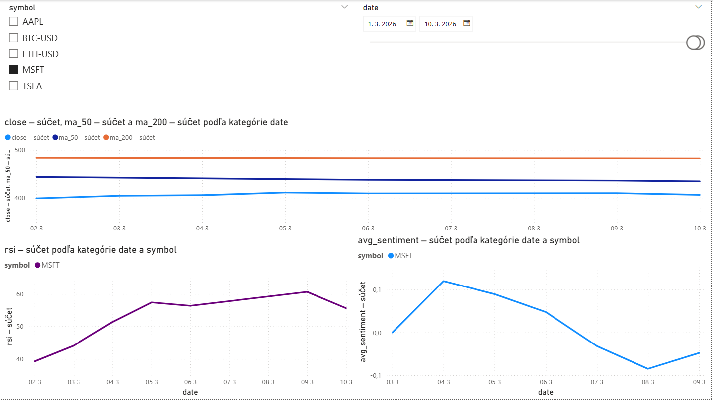

# 📊 Financial Intelligence Tracker

Automatizovaný systém na sledovanie finančných trhov a sentiment analýzu správ.

## 🏗️ Architektúra
`Yahoo Finance / NewsAPI` → `Python` → `GitHub Actions` → `Google BigQuery` → `Power BI`

## 🛠️ Technológie
- **Python** — sťahovanie dát (yfinance, NewsAPI, VADER sentiment)
- **GitHub Actions** — automatické spúšťanie každú noc o 22:00 UTC
- **Google BigQuery** — cloudová databáza
- **SQL** — Moving Averages, RSI, Sentiment Lag Analysis
- **Power BI** — interaktívny dashboard

## 📈 Sledované symboly
AAPL, TSLA, MSFT, BTC-USD, ETH-USD

## 🔍 Kľúčové zistenia
- RSI indikátor ukazuje že AAPL je momentálne v neutrálnej zóne (37)
- MA50 klesla pod MA200 pre MSFT — bearish signál
- Sentiment správ pre Bitcoin je mierne negatívny v posledných dňoch

## 📊 Dashboard
